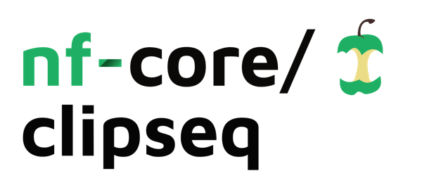

<h1>
  <picture>
    <source media="(prefers-color-scheme: dark)" srcset="docs/images/nf-core-clipseq_logo_dark.png">
    
  </picture>
</h1>

[](https://nf-co.re/clipseq/results)[](https://doi.org/10.5281/zenodo.XXXXXXX)
[](https://github.com/nf-core/clipseq/actions/workflows/ci.yml)
[](https://github.com/nf-core/clipseq/actions/workflows/linting.yml)[](https://nf-co.re/clipseq/results)[](https://doi.org/10.5281/zenodo.XXXXXXX)
[](https://www.nf-test.com)

[](https://www.nextflow.io/)
[](https://docs.conda.io/en/latest/)
[](https://www.docker.com/)
[](https://sylabs.io/docs/)
[](https://cloud.seqera.io/launch?pipeline=https://github.com/nf-core/clipseq)

[](https://nfcore.slack.com/channels/clipseq)[](https://twitter.com/nf_core)[](https://mstdn.science/@nf_core)[](https://www.youtube.com/c/nf-core)

## Introduction

**nf-core/clipseq** is a bioinformatics pipeline that ...

<!-- TODO nf-core:
   Complete this sentence with a 2-3 sentence summary of what types of data the pipeline ingests, a brief overview of the
   major pipeline sections and the types of output it produces. You're giving an overview to someone new
   to nf-core here, in 15-20 seconds. For an example, see https://github.com/nf-core/rnaseq/blob/master/README.md#introduction
-->

<!-- TODO nf-core: Include a figure that guides the user through the major workflow steps. Many nf-core
     workflows use the "tube map" design for that. See https://nf-co.re/docs/contributing/design_guidelines#examples for examples.   -->
<!-- TODO nf-core: Fill in short bullet-pointed list of the default steps in the pipeline -->

By default, the pipeline currently performs the following:

1. Adapter and quality trimming (`TrimGalore!`)
2. Pre-mapping to e.g. rRNA and tRNA sequences (`Bowtie`)
3. Genome mapping (`STAR`)
4. UMI-based deduplication (`UMI-tools`)
5. Crosslink identification (`BEDTools`)
6. Bedgraph coverage track generation (`BEDTools`)
7. Crosslink summaries over RNA types (`iCount Summary`)
8. Crosslink metagene profiles (`iCount Metagene`)
9. Peak calling (multiple options):
   - `iCount`
   - `Paraclu`
   - `PureCLIP`
   - `Clippy`
10. Consensus peak output, ie. grouping all crosslinks, calling peaks and reporting a table with individual sample counts over consensus peaks. Useful as an input for differential binding analyses.
11. Motif detection (`PEKA`)
12. Overall pipeline run and QC summaries and peak calling comparisons (`MultiQC`)

## Usage

> **Note**
> If you are new to Nextflow and nf-core, please refer to [this page](https://nf-co.re/docs/usage/installation) on how
> to set-up Nextflow. Make sure to [test your setup](https://nf-co.re/docs/usage/introduction#how-to-run-a-pipeline)
> with `-profile test` before running the workflow on actual data.

First, prepare a samplesheet with your input data that looks as follows:

`samplesheet.csv`:

```csv
sample_name,group_name,input_name,fastq
PHO92_A,PHO92,HNRNPC,https://github.com/luslab/test-datasets/raw/clipseq/v_2_0/fastq/ERR3988069-yeast-quarter.fastq.gz
PHO92_B,PHO92,HNRNPC,https://github.com/luslab/test-datasets/raw/clipseq/v_2_0/fastq/ERR3988069-yeast-quarter.fastq.gz
PHO92_C,PHO92,HNRNPC,https://github.com/luslab/test-datasets/raw/clipseq/v_2_0/fastq/ERR3988069-yeast-quarter.fastq.gz
HNRNPC,,,https://github.com/luslab/test-datasets/raw/clipseq/v_2_0/fastq/ERR3988069-yeast-quarter.fastq.gz
```

Each row represents a fastq file (single-end). If multiple rows have the same `sample_name`, `group_name` and `input_name` then their fastqs will be concatenated at the beginning of the pipeline (eg. in the case of a sample that was resequenced and so has multiple fastq files). If multiple rows have different `sample_name`s but the same `group_name` and `input_name`, then the crosslinks for these samples will be merged and peaks and downstream analyses will be run on the grouped crosslinks.

The `input_name` is used for providing input data, currently the only peak caller we support that can use input data is PureCLIP. The `input_name` must match either a `sample_name` or a `group_name`.

Now, you can run the pipeline using:

```bash
nextflow run nf-core/clipseq \
   -profile test, <docker/singularity/.../institute> \
   --outdir <OUTDIR>
```

> **Warning:**
> Please provide pipeline parameters via the CLI or Nextflow `-params-file` option. Custom config files including those
> provided by the `-c` Nextflow option can be used to provide any configuration _**except for parameters**_;
> see [docs](https://nf-co.re/usage/configuration#custom-configuration-files).

For more details, please refer to the [usage documentation](https://nf-co.re/clipseq/usage) and the [parameter documentation](https://nf-co.re/clipseq/parameters).

## Pipeline output

To see the the results of a test run with a full size dataset refer to the [results](https://nf-co.re/clipseq/results) tab on the nf-core website pipeline page.
For more details about the output files and reports, please refer to the
[output documentation](https://nf-co.re/clipseq/output).

## A note on paired-end reads

The pipeline currently does not support paired-end reads, as in our experience alignment using both reads when available doesn't improve analysis of CLIP data. When recieving CLIP data sequenced paired-end, we recommend running the pipeline with the read containing the crosslink and ensuring the crosslink_position parameter is set appropriately. If you have evidence to the contrary please do get in touch and let us know, or if you are working on a new variant protocol where paired-end alignment is important please do reach out.

## A note on annotation

Certain tools for peak-calling, motif discovery and analysis of crosslink distribution around landmarks or transcript regions (Clippy, PEKA, iCount summary and iCount RNA-maps) rely on GTF files generated by the [iCount-Mini](https://github.com/ulelab/iCount-Mini) segment script. Segmentation splits the genome into regions like CDS, UTR3, UTR5, ncRNA, introns, and intergenic, at the transcript-level (producing the segmentation GTF) and at the genome level (producing flattened regions GTF).
Pre-filtering the genomic annotation can improve genome-level segmentation by iCount or ensure that regions from representative transcripts are prioritized over others.

Pre-filtering is performed by the FILTER_GTF_BY_TRANSCRIPTS module of the pipeline, and is enabled by setting `--skip_gtf_filter` to `false` (or omitting the parameter). This filters the annotation GTF to include only transcripts of interest, which can be provided by the as a text file with `--representative_transcript` or, if not given, automatically selected based on the longest spliced transcript per gene, using the following hierarchy (longest CDS > longest total exon length). For the user-provided set of transcripts, please make sure that the text file lists one transcript ID per row and that exactly one transcript ID is provided for each gene in the annotation GTF file that is subject to filtering.

If segmentation is performed on the filtered annotation, some regions may remain unannotated because the "gene-level" annotation can extend beyond the boundaries of transcripts that remain after filtering. The pipeline identifies these unannotated regions in the iCount genomic segment (regions.gtf) (during the RESOLVE_UNANNOTATED process) and annotates them according to the regions obtained with the unfiltered GTF. This means that segmentation with iCount-Mini is performed twice whenever GTF filtering is enabled: once on the original unfiltered GTF and once on the filtered GTFs. Regions generated from the unfiltered GTF are used to impute missing regions into the regions GTF, produced from filtered annotation.

Essentially, when the annotation filtering is enabled, the genomic regions-UTR5, CDS, UTR3, intron, ncRNA and intergenic-will generally correspond to a single representative transcript selected per gene. If the filtering is disabled, the genomic regions will be assigned by collapsing the transcript-level segmentation across all transcripts annotated for the gene of interest, using iCount's designated hierarchy. You can read more about how the segmentation is performed in the [documentation for the iCount segment](https://icount.readthedocs.io/en/latest/_modules/iCount/genomes/segment.html)

Note that iCount segmentation currently only supports Ensembl and GENCODE style annotations. The filtering process also requires the annotation of genes, transcript's, and transcript's exons to work. If your annotation does not meet these standards you might consider skipping filtering.

## Credits

nf-core/clipseq was originally written by Charlotte West ([@charlotte-west](https://github.com/charlotte-west)) and Anob Chakrabarti ([@amchakra](https://github.com/amchakra)) from [Luscombe Lab](https://www.crick.ac.uk/research/labs/nicholas-luscombe) at [The Francis Crick Institute](https://www.crick.ac.uk/), London, UK. It started life in April 2020 as a Nextflow DSL2 Luscombe Lab ([@luslab](https://github.com/luslab)) lockdown hackathon day and we thank all the lab members for their early contributions.

v2.0 was spearheaded by [Ule lab](https://github.com/ulelab) in collaboration with [Goodwright Ltd.](https://goodwright.com/); namely Charlotte Capitanchik ([@CharlotteAnne](https://github.com/charlotteanne)), Chris Cheshire and Sam Ireland.

We thank the following people for their extensive assistance in the development of this pipeline:
Ira Iosub, Marc Jones, Rupert Faraway, Oscar G. Wilkins, Klara Kuret, Simon Murray

## Contributions and Support

If you would like to contribute to this pipeline, please see the [contributing guidelines](.github/CONTRIBUTING.md).

For further information or help, don't hesitate to get in touch on the [Slack `#clipseq` channel](https://nfcore.slack.com/channels/clipseq) (you can join with [this invite](https://nf-co.re/join/slack)).

## Citations

<!-- TODO nf-core: Add citation for pipeline after first release. Uncomment lines below and update Zenodo doi and badge at the top of this file. -->
<!-- If you use  nf-core/clipseq for your analysis, please cite it using the following doi: [10.5281/zenodo.XXXXXX](https://doi.org/10.5281/zenodo.XXXXXX) -->

<!-- TODO nf-core: Add bibliography of tools and data used in your pipeline -->

An extensive list of references for the tools used by the pipeline can be found in the [`CITATIONS.md`](CITATIONS.md) file.

You can cite the `nf-core` publication as follows:

> **The nf-core framework for community-curated bioinformatics pipelines.**
>
> Philip Ewels, Alexander Peltzer, Sven Fillinger, Harshil Patel, Johannes Alneberg, Andreas Wilm, Maxime Ulysse Garcia, Paolo Di Tommaso & Sven Nahnsen.
>
> _Nat Biotechnol._ 2020 Feb 13. doi: [10.1038/s41587-020-0439-x](https://dx.doi.org/10.1038/s41587-020-0439-x).
